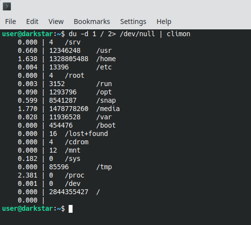

climon - command line monitor

When piping multiline output to climon it will be printed with a prefix of each line,
the time (in seconds) it took for the line to be piped into climon.

## Usage

``Usage: someapp | climon [-NoAnsi]``

Example:

## Buffering

Due to performance, a classic unix terminal usually buffer the output, and there are actually
three different types of buffering; full (multi-line buffering), line, and character (no buffering).
As default, stdio which handles terminal output in C applications, is usually detecting if
the application output is being piped, and then using full buffering, else line buffering.

To pipe the output of an existing app to climon using line buffering instead of full buffering,
you have to make it think it's using standard terminal output instead of a pipe, to do that,
use this trick:

``script -q -c "someapp somearg" | climon``

Caution: The script tool will unfortunately also create a junk file named "typescript" in the current dir.
(There are convoluted ways to prevent that, usually by embedding some bash code in the
``"someapp someargs"`` command, but it's usually most easy to just delete the file afterwards).

## Function

Time is updated for each character read from stdin, like this (pseudo code):

    <save position>
    <go to beginning of line>
    Print time
    <restore position>
    Print read character

This requires ansi support in the terminal, which of course not all terminals support, e.g. github actions.
But Windows (since 2019), Macos, and Linux support the used ansi codes ootb. Use the -NoAnsi flag to climon
to disable usage of ansi codes, this will make climon not print the time as often.
